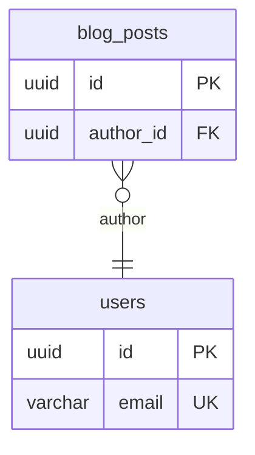

# typeorm-docs-mcp

Offline TypeORM schema documentation tools for both humans and AI clients.

`typeorm-docs-mcp` analyzes TypeORM entity source files without connecting to a database. It produces a canonical schema graph, Mermaid ERD, Markdown documentation, and a missing-documentation audit. The same core implementation powers both the CLI and MCP tools.

## Why this exists

This project is not meant to wrap work that an AI could do by reading files directly. The goal is to provide deterministic schema extraction and scriptable outputs that are useful on their own, while also giving AI clients stable schema context for database design review.

## Clean-room note

The project is inspired by ORM-to-Markdown and ERD documentation workflows, but it does not copy implementation code, file structure, tests, or README text from `prisma-markdown`.

## CLI usage

```bash
typeorm-docs-mcp analyze --entities "src/**/*.entity.ts"
typeorm-docs-mcp erd --entities "src/**/*.entity.ts"
typeorm-docs-mcp markdown --entities "src/**/*.entity.ts" --title "Schema" --output ERD.md
typeorm-docs-mcp audit --entities "src/**/*.entity.ts"
typeorm-docs-mcp serve
```

### Example ERD output



### Example audit output

```json
{
  "missingTableDescriptions": [],
  "missingColumnDescriptions": ["blog_posts.body"],
  "missingRelationDescriptions": []
}
```

## MCP tools

Start the MCP server over stdio:

```bash
typeorm-docs-mcp serve
```

Available tools:

- `analyze_typeorm_schema`
- `generate_mermaid_erd`
- `generate_typeorm_markdown`
- `find_undocumented_schema`

Common input:

```json
{
  "entities": "src/**/*.entity.ts",
  "projectRoot": "/absolute/path/to/project"
}
```

## MVP limitations

- Offline source analysis only.
- No database connection or credential handling.
- No `DataSource.initialize()` live metadata mode yet.
- No migration diff analysis yet.
- No HTML documentation output yet.

## Development

```bash
npm install
npm test
npm run build
```
